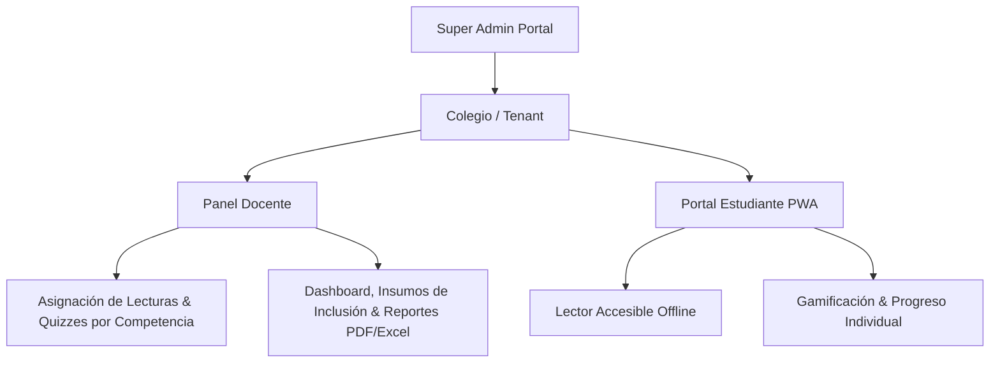

# 🎯 Alcance del Proyecto & Hoja de Ruta B2B (aLeer)

> **Visión General**: Transformar **aLeer** de una PWA de lectura accesible a una plataforma B2B EdTech de alto impacto para colegios e instituciones educativas en LATAM, bajo un modelo de licenciamiento por estudiante/año.

---

## 📌 1. Diagnóstico del Estado Actual (Fortalezas & Diferenciadores)

* **Pedagógicamente Sólido**: Catálogo de técnicas comprobadas (RSVP, Bionic Reading, Chunking, Skimming, Cloze) con impacto directo en comprensión y velocidad lectora.
* **Accesibilidad Universal (WCAG 2.1 AA)**: OpenDyslexic, lector de voz (TTS), contraste dinámico y modos adaptativos (TDAH/Dislexia).
* **Offline-First (Ventaja Competitiva en LATAM)**: Funcionamiento offline con PWA e IndexedDB, óptimo para entornos educativos con conectividad limitada.
* **Arquitectura de Datos Multi-tenant**: Estructura de Firestore basada en `schoolId -> teacherId -> classId -> studentId` con reglas de seguridad estrictas.

---

## 🚀 2. Enfoque Estratégico B2B (Colegios & Escuelas)

### 🎯 **Público Objetivo**
* **Compradores**: Rectores, Directores Académicos, Coordinadores de Inclusión/Orientación y Comités Educativos.
* **Usuarios**: Docentes de Lenguaje/Español y Estudiantes de K-12.

### 💰 **Modelo de Negocio & Pricing**
* **Suscripción Anual por Estudiante**: Tarifas por año escolar (alineadas con el presupuesto académico de los colegios), con descuentos por volumen.
* **Onboarding Automatizado**: Carga masiva de estudiantes mediante CSV, PIN de sesión o SSO institucional.

---

## ⚡ 3. Palancas de Aceleración de Ventas (Refinadas & Conforme a Norma)

Para maximizar el alcance y cerrar contratos institucionales sin riesgos legales ni pedagógicos, se establecen 5 palancas refinadas:

1. **Insumo Pedagógico de Inclusión ("Registro de Ajustes Lectores")**:
   * *Ajuste Normativo*: No califica diagnósticos médicos ni suplanta el PIAR oficial (Decreto 1421). Genera el *"Registro de Avances y Ajustes Lectores"*, un documento de insumo pedagógico para los comités de evaluación y carpetas de orientación.
   * *Habeas Data (Ley 1581)*: **No almacena datos de salud ni diagnósticos clínicos**. Solo registra métricas pedagógicas (WPM, tasa de acierto y preferencias de accesibilidad visual).
2. **Evaluación Psicometría por Competencias (ICFES Saber / PISA / SIMCE)**:
   * Evalúa separadamente velocidad (WPM) de la comprensión profunda.
   * Quizzes estructurados y categorizados por competencias oficiales (**Literal, Inferencial y Crítica/Sintáctica**), respaldados por datos medibles reales.
3. **Diagnóstico Exprés por PIN de Sesión (Cero Fricción)**:
   * Prueba diagnóstica inicial de 3 minutos ejecutada por **Código de Sesión PIN** (estilo Kahoot/Nearpod), sin requerir registro individual de correos para 300+ alumnos en 1 día. Genera el *"Mapa de Salud Lectora"* del colegio.
4. **Estrategia "Freemium Docente" con Migración de Tenant (PLG)**:
   * Permite a un docente usar la app gratis en 1 aula (hasta 25 alumnos). 
   * *Arquitectura de Datos*: Incluye el proceso de **Fusión/Reconciliación de Cuentas (`claimSchoolTenant`)** para vincular automáticamente aulas freemium al tenant institucional del colegio al cerrar la venta.
5. **Boletín para Padres con QR Seguro (Protección de Menores)**:
   * Generación de reportes visuales en PDF para las familias.
   * *Seguridad Ciber*: Los códigos QR contienen **tokens temporales firmados criptográficamente (o PIN de validación)**, impidiendo que datos de menores sean públicos o indexables.

---

## 🛠️ 4. Módulos Clave del Sistema (Core Product)

### **A. Panel Docente & Gestión Académica**
* **Asignación de Lecturas**: Asignación diferenciada por grado, tema y nivel de dificultad.
* **Evaluación de Comprensión**: Quizzes automáticos por competencia (Literal, Inferencial, Crítica) generados por IA o catálogo.
* **Semáforo de Riesgo Lector**: Identificación oportuna de estudiantes con rezago en WPM o comprensión.
* **Reportes Exportables**: Descarga de informes individuales, grupales e insumos de inclusión en PDF/Excel.

### **B. Experiencia del Estudiante (PWA Accesible)**
* **Entrenamiento Adaptativo**: Incremento gradual de WPM según desempeño sin degradar comprensión.
* **Soporte de Inclusión**: Ajustes instantáneos de tipografía, tamaño, espaciado y lectura en voz alta.
* **Modo Offline**: Registro local de avances y sincronización automática al recuperar internet.

### **C. Infraestructura & Cumplimiento**
* **Habeas Data & Ley 1581 (Colombia/LATAM)**: Protección estricta de datos de menores; cero almacenamiento de datos médicos sensibles.
* **Seguridad Servidor**: Firestore Security Rules strictly scoped por rol (`teacher` / `student`).
* **Inteligencia Artificial Híbrida**: Procesamiento local mediante Web Worker (`@huggingface/transformers`) y nube opcional vía servidor.

---

## 🗺️ 5. Hoja de Ruta Priorizada (Roadmap)

### 🟢 **Fase 1: Preparación Institucional & Pilotos (En Curso)**
- [x] Reglas de seguridad de Firestore y eliminación de fallbacks locales.
- [x] Control de concurrencia en Workers de IA e higiene de datos.
- [x] Panel docente para creación de clases y seguimiento.
- [ ] Exportación de reportes en PDF/Excel (Ficha individual + Registro de Ajustes Lectores).
- [ ] Módulo de carga masiva por CSV y Código PIN de Sesión (Diagnóstico Exprés).

### 🟡 **Fase 2: Integración & Automatización (Próximo Trimestre)**
- [ ] Mecanismo de reconciliación de cuentas Freemium a Tenant Institucional (`claimSchoolTenant`).
- [ ] Cifrado y tokens de seguridad en códigos QR para boletines de padres.
- [ ] Integración de SSO con Google Workspace for Education.
- [ ] Banco de lecturas categorizado por competencias ICFES / Saber.

### 🔴 **Fase 3: Expansión & Ecosistema (Futuro)**
- [ ] Integración con LMS (Google Classroom / Canvas).
- [ ] Soporte bilingüe completo (Español / Inglés).

> ⚠️ **Nota de Enfoque**: Se descartan desarrollos de hardware (VR/AR, eye-tracking) para concentrar el 100% de la ingeniería en funciones que impulsan la venta, satisfacción de padres y retención B2B educativa con estricto apego a la ley.
