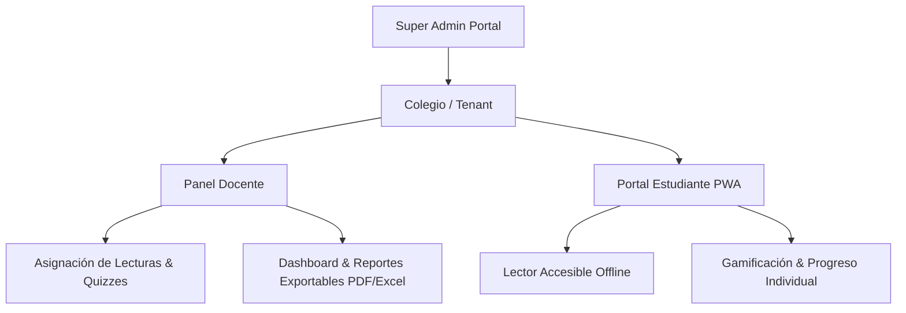

# 🎯 Alcance del Proyecto & Hoja de Ruta B2B (aLeer)

> **Visión General**: Transformar **aLeer** de una PWA de lectura accesible a una plataforma B2B EdTech de alto impacto para colegios e instituciones educativas en LATAM, bajo un modelo de licenciamiento por estudiante/año.

---

## 📌 1. Diagnóstico del Estado Actual (Fortalezas & Diferenciadores)

* **Pedagógicamente Sólido**: Catálogo de técnicas comprobadas (RSVP, Bionic Reading, Chunking, Skimming, Cloze) con impacto directo en comprensión y velocidad lectora.
* **Accesibilidad Universal (WCAG 2.1 AA)**: OpenDyslexic, lector de voz (TTS), contraste dinámico y modos adaptativos (TDAH/Dislexia).
* **Offline-First (Ventaja Competitiva en LATAM)**: Funcionamiento offline con PWA e IndexedDB, óptimo para entornos educativos con conectividad limitada.
* **Arquitectura de Datos Multi-tenant**: Estructura de Firestore basada en `schoolId -> teacherId -> classId -> studentId` con reglas de seguridad estrictas.

---

## 🚀 2. Enfoque Estratégico B2B (Colegios & Escuelas)

### 🎯 **Público Objetivo**
* **Compradores**: Rectores, Directores Académicos, Coordinadores de Inclusión/PIAR y Comités Educativos.
* **Usuarios**: Docentes de Lenguaje/Español y Estudiantes de K-12.

### 💰 **Modelo de Negocio & Pricing**
* **Suscripción Anual por Estudiante**: Tarifas por año escolar (alineadas con el presupuesto académico de los colegios), con descuentos por volumen.
* **Onboarding Automatizado**: Carga masiva de estudiantes mediante CSV o SSO institucional.

---

## 🛠️ 3. Módulos Clave del Sistema (Core Product)

### **A. Panel Docente & Gestión Académica**
* **Asignación de Lecturas**: Asignación diferenciada por grado, tema y nivel de dificultad.
* **Evaluación de Comprensión**: Quizzes automáticos (opción múltiple y preguntas abiertas) generados por IA o catálogo.
* **Semáforo de Riesgo Lector**: Identificación oportuna de estudiantes con rezago en WPM o comprensión.
* **Reportes Exportables**: Descarga de informes individuales y grupales en PDF/Excel para presentar a coordinación y padres de familia.

### **B. Experiencia del Estudiante (PWA Accesible)**
* **Entrenamiento Adaptativo**: Incremento gradual de WPM según desempeño.
* **Soporte de Inclusión**: Ajustes instantáneos de tipografía, tamaño, espaciado y lectura en voz alta.
* **Modo Offline**: Registro local de avances y sincronización automática al recuperar internet.

### **C. Infraestructura & Cumplimiento**
* **Habeas Data & Ley 1581 (Colombia/LATAM)**: Protocolos de protección de datos de menores y consentimiento institucional.
* **Seguridad Servidor**: Firestore Security Rules strictly scoped por rol (`teacher` / `student`).
* **Inteligencia Artificial Híbrida**: Procesamiento local mediante Web Worker (`@huggingface/transformers`) y nube opcional vía servidor.

---

## 🗺️ 4. Hoja de Ruta Priorizada (Roadmap)

### 🟢 **Fase 1: Preparación Institucional & Pilotos (En Curso)**
- [x] Reglas de seguridad de Firestore y eliminación de fallbacks locales.
- [x] Control de concurrencia en Workers de IA e higiene de datos.
- [x] Panel docente para creación de clases y seguimiento.
- [ ] Exportación de reportes en PDF/Excel para entregables a padres.
- [ ] Módulo de carga masiva de alumnos por archivo CSV.

### 🟡 **Fase 2: Integración & Automatización (Próximo Trimestre)**
- [ ] Integración de SSO con Google Workspace for Education.
- [ ] Banco de lecturas alineado por grados académicos (Primaria y Secundaria).
- [ ] Módulo de licenciamiento institucional (gestión de cupos/seats activos).

### 🔴 **Fase 3: Expansión & Ecosistema (Futuro)**
- [ ] Integración con LMS (Google Classroom / Canvas).
- [ ] Soporte bilingüe completo (Español / Inglés).

> ⚠️ **Nota de Enfoque**: Se descartan temporalmente desarrollos de hardware (VR/AR, eye-tracking) para concentrar el 100% de la ingeniería en funciones que impulsan la venta y retención B2B educativa.
