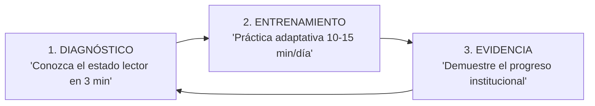

# aLeer — Plataforma de Evaluación y Entrenamiento de Comprensión Lectora 🚀

> **Mide. Entrena. Demuestra el progreso.**  
> **aLeer** es una plataforma educativa B2B diseñada para colegios e instituciones en LATAM. Combina diagnósticos exprés, entrenamiento adaptativo accesible (PWA Offline-First) y evidencia analítica medible del progreso lector.

---

## 🎯 Propuesta de Valor Institucional

aLeer estructura el aprendizaje lector en un ciclo continuo y medible:

1. **MEDIR (Diagnóstico Exprés)**: Evaluación rápida mediante código PIN de sesión para identificar el nivel inicial del colegio sin fricción de registros.
2. **ENTRENAR (Práctica Adaptativa)**: Ejercicios diarios personalizados (10-15 min) utilizando técnicas avanzadas (RSVP, Bionic Reading, Chunking, Line Focus) con soporte de accesibilidad universal.
3. **DEMOSTRAR (Evidencia Medible)**: Dashboards institucionales y reportes descargables que reflejan el avance en comprensión, fluidez y precisión.

---

## ✨ Características Principales

### 📊 **1. Panel Docente & Diagnóstico Institucional**
- **Semáforo Pedagógico No-Clínico**:
  - 🟢 **Consolidado**: Desempeño lector óptimo.
  - 🟡 **En Desarrollo**: Progresando hacia los objetivos.
  - 🔴 **Requiere Acompañamiento**: Estudiantes con necesidad de refuerzo.
- **Diagnóstico por PIN de Sesión**: Los alumnos ingresan a pruebas grupales mediante un código PIN de 6 dígitos sin necesidad de correos individuales.
- **Reportes e Insumos Pedagogicos**: Exportación de reportes de progreso y plantillas de apoyo para comités de evaluación e inclusión.

### 📖 **2. Experiencia del Estudiante & Accesibilidad Universal (WCAG 2.1 AA)**
- **Motor Adaptativo**: Ajusta dinámicamente la velocidad (WPM) y complejidad según el desempeño del estudiante.
- **Técnicas de Entrenamiento**:
  - **RSVP Morfológico**: Presentación visual serial rápida alineada al punto óptimo de fijación.
  - **Bionic Reading**: Énfasis silábico inicial para facilitar el reconocimiento visual (ideal para dislexia).
  - **Chunking**: Agrupamiento semántico contextual.
  - **Line Focus & Highlight**: Enfoque guiado para mejorar el seguimiento de líneas.
- **Soporte Accesible**: Tipografía OpenDyslexic, síntesis de voz (TTS), modos de alto contraste y soporte adaptativo para TDAH.

### ⚡ **3. Offline-First PWA & IA Local**
- **Funcionamiento Sin Internet**: PWA con persistencia en `IndexedDB`, ideal para colegios rurales o entornos con conectividad inestable.
- **IA Local Cero-Costo**: Web Worker integrado (`@huggingface/transformers`) que ejecuta resúmenes y preguntas en el navegador del estudiante sin consumir APIs pagadas.

---

## 🛠️ Arquitectura Técnica & Seguridad

- **Frontend**: React 19 + Vite 7 + Tailwind CSS.
- **Base de Datos & Seguridad**: Firebase Firestore con arquitectura multi-tenant (`schoolId -> teacherId -> classId -> studentId`) protegida por **Firestore Security Rules** sin almacenamiento inseguro de tokens en `localStorage`.
- **Protección de Datos (Habeas Data / Ley 1581)**: La plataforma **no almacena ni infiere diagnósticos médicos clínicos**. Guarda exclusivamente datos pedagógicos y métricas de lectura.
- **Concurrencia de IA**: Procesamiento en colas FIFO dentro de Web Workers con límite estricto de memoria RAM para evitar caídas de navegador en aulas de clase.

---

## 🗺️ Roadmap B2B (2026)

### 🟢 **Fase 1: Diagnóstico & Evidencia (En Curso)**
- [x] Reglas de seguridad en Firestore y arquitectura multi-tenant.
- [x] Persistencia offline nativa con IndexedDB.
- [x] Control de concurrencia de IA e higiene de memoria RAM.
- [ ] Diagnóstico exprés con Código PIN de Sesión.
- [ ] Carga masiva de alumnos mediante archivos CSV.
- [ ] Exportación de reportes en PDF/Excel para familias y coordinadores.

### 🟡 **Fase 2: Motor Adaptativo & Reconciliación (Próximo Trimestre)**
- [ ] Reconciliación automática de cuentas Freemium a Tenant Institucional (`claimSchoolTenant`).
- [ ] Banco de lecturas categorizado por competencias psicométricas (**Literal, Inferencial, Crítica**).
- [ ] Tokens de seguridad cifrados en códigos QR para boletines de padres.

### 🔴 **Fase 3: Integración Ecosistema (Futuro)**
- [ ] Integración de SSO con Google Workspace for Education.
- [ ] Integración con LMS (Google Classroom / Canvas).

---

## 📄 Licencia

Este proyecto está protegido bajo la Licencia MIT.