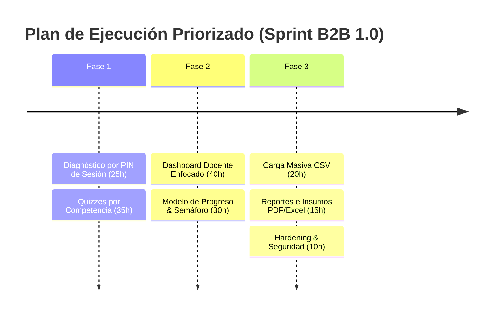
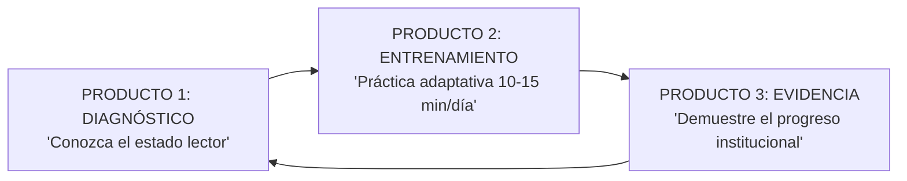

# 📑 aLeer 1.0 — Auditoría Técnica y Plan de Redirección B2B

> **Estrategia Core**: Transformar aLeer de un "Frankenstein de funcionalidades y técnicas" a un producto B2B enfocado en un ciclo claro:  
> **Mide (Diagnóstico) ➔ Entrena (Práctica Adaptativa) ➔ Demuestra (Evidencia del Progreso)**

---

## 📊 1. Evaluación del Estado Real del Código vs. Estrategia B2B

| Módulo / Componente | % Madurez | Diagnóstico Técnico | Acción Recomendada |
| :--- | :---: | :--- | :--- |
| **Motor de Lectura** | 75% | Estable con RSVP, Bionic, Chunking y Line Focus. | **CONSERVAR**: Mantener como herramienta de entrenamiento, eliminando promesas pseudocientíficas. |
| **PWA & Offline-First** | 75% | Service Worker e IndexedDB operativos. | **CONSERVAR**: Es la ventaja competitiva principal en LATAM. |
| **Firebase & Seguridad** | 80% | Firestore multi-tenant (`schoolId->teacherId->classId->studentId`). **Reglas de seguridad blindadas**: eliminadas puertas traseras `!exists()`, aislamiento por `schoolId` y validación estricta `request.resource.data.studentId == request.auth.uid`. | **CONSERVAR & EXTENDER**: Soporte para unión de cuentas freemium a tenant (`claimSchoolTenant`). |
| **Panel Docente & Reportes** | 65% | `TeacherDashboard`, `TeacherReports`, `TeacherConfig` y `ClassJoin` operativos. | **REESTRUCTURAR**: Enfocar en los 3 pilares (*Diagnóstico, Entrenamiento, Evidencia*). |
| **Evaluación Pedagógica** | 50% | Preguntas de opción múltiple y abiertas. | **REESCRIBIR**: Estructurar quizzes por competencias psicométricas (**Literal, Inferencial, Crítica/Sintáctica**). |
| **IA Worker Local** | 70% | HuggingFace Web Worker con cola de concurrencia FIFO y límite de 2 modelos en RAM. | **CONSERVAR & EVOLUCIONAR**: Dirigir la IA hacia un **Motor de Recomendación Adaptativo** de lecturas. |
| **Multi-tenant / Roles** | 65% | Reglas en nube para `teacher` y `student`. | **EXTENDER**: Agregar onboarding por **Código PIN de Sesión** (estilo Kahoot) y CSV. |
| **Módulos Residuales (VR/AR/Eye-tracking)** | 0% | No existen en código, pero contaminaban el README. | **ELIMINAR DEL ROADMAP**: Depurar totalmente de la documentación. |

---

## ✂️ 2. Matriz: Qué Conservar / Qué Eliminar / Qué Reescribir / Qué Construir Primero

### 🟢 **1. QUÉ CONSERVAR (Core Tecnológico Estilizado)**
- **Offline-First PWA & IndexedDB**: Mantiene aLeer funcional en escuelas rurales o sin internet.
- **Motor de Accesibilidad (WCAG 2.1 AA)**: OpenDyslexic, lector de voz (TTS), contraste dinámico y fuentes legibles.
- **Reglas de Seguridad de Firestore**: Arquitectura multi-tenant autenticada sin fallbacks insecure en `localStorage`.
- **Cola de Concurrencia de IA**: Procesamiento secuencial que evita el colapso de RAM en navegadores escolares.

### 🔴 **2. QUÉ ELIMINAR O CONGELAR (Sin Valor Comercial Inmediato)**
- ❌ **Promesas de VR/AR, Eye-tracking y Wearables**: Eliminados del roadmap e historias del proyecto.
- ❌ **Integraciones complejas tempranas (LMS Canvas/Moodle, SSO Entra/SAML)**: Pospuestas hasta tener clientes corporativos pagando que lo soliciten.
- ❌ **WPM como objetivo principal único**: Redefinido como una variable secundaria dentro del **Índice de Desempeño Lector**.
- ❌ **Afirmaciones pseudocientíficas ("rutas neurolingüísticas", "predicción de fatiga visual")**: Sustituidas por métricas pedagógicas directas.

### 🟡 **3. QUÉ REESCRIBIR / AJUSTAR (Rediseño Pedagógico)**
- 🔄 **Semáforo Lector No-Clínico**:
  - 🟢 **Consolidado** (desempeño óptimo)
  - 🟡 **En desarrollo** (progreso esperado)
  - 🔴 **Requiere acompañamiento** (necesidad de refuerzo pedagógico)
- 🔄 **Evaluaciones por Competencias Oficiales**: Categorización estricta de quizzes en competencia **Literal**, **Inferencial** y **Crítica** (alineado a pruebas estandarizadas).
- 🔄 **Registro de Ajustes Lectores**: Insumo pedagógico descargable para comités de evaluación y carpetas de orientación, **sin almacenar datos médicos de discapacidad (Ley 1581)**.

### 🚀 **4. QUÉ CONSTRUIR PRIMERO (Prioridades de Ingenieria - 200 Horas)**

1. **Prueba Diagnóstica Exprés con PIN de Sesión (Estilo Kahoot / Nearpod)**:
   - El docente genera un PIN de 6 dígitos (ej. `AL-8492`).
   - Estudiantes ingresan PIN + Nombre en la PWA sin crear correos manuales.
   - Genera el *"Mapa de Salud Lectora"* del grupo en 3 minutos.
2. **Dashboard Docente Simplificado (Mide - Entrena - Demuestra)**:
   - Resumen limpio por grupo: Comprensión Promedio, Fluidez (WPM), Precisión y Variación de Progreso (`+13%`).
3. **Carga Masiva de Estudiantes vía CSV**:
   - Plantilla simple (`nombre, apellido, grado, grupo, codigo`).
4. **Fusión de Cuentas Freemium a Tenant (`claimSchoolTenant`)**:
   - Permite convertir un aula gratuita de 1 docente en un colegio institucional con 1 clic.

---

## 🎯 3. Redefinición del Producto: Los 3 Pilares

1. **PRODUCTO 1 — DIAGNÓSTICO**: *"Conozca el estado lector real de sus estudiantes en 3 minutos."*
2. **PRODUCTO 2 — ENTRENAMIENTO**: *"Entrenamiento adaptativo diario (10-15 min) ajustado al perfil del estudiante."*
3. **PRODUCTO 3 — EVIDENCIA**: *"Demuestre el progreso medible de su institución ante la comunidad y los padres."*

---

## 📝 4. Compromiso de Actualización de Documentación

- [x] **Audit y Plan B2B**: Creación de `aLeer_1.0_Audit_and_Plan.md`.
- [ ] **README.md 2026**: Reescribir completamente el README para reflejar la propuesta de valor *"Mide. Entrena. Demuestra el progreso."*, eliminando referencias obsoletas a 2024/2025 y hardware futurista.
- [ ] **PROJECT_SCOPE.md**: Sincronizar nomenclaturas pedagógicas no-clínicas (*Consolidado / En desarrollo / Requiere acompañamiento*).
